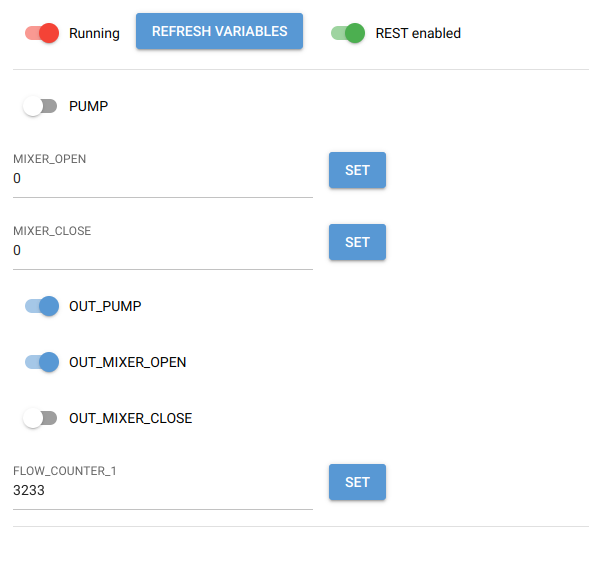

FXPLC
======

Python connector for low-level Mitsubishi MELSEC FX series (FX-232AW) serial protocol.

Protocol specification - [Link](http://www.inverter-plc.com/plc/melsec/FX-232AW%20USER%20MANUAL.pdf)

Note it is not the same as _Non-Protocol Communication_ (or _D8120_) as described in _FX Series Programmable Controllers_ manuals.

## Overview

Python library and CLI utility allow to read and write PLC registers like `X0`, `Y0`, `S0`, `T0`, `M0` and `D0`.

## Example usage

### Library

```python
import asyncio
from contextlib import closing
from fxplc.client.FXPLCClient import FXPLCClient
from fxplc.transports.TransportSerial import TransportSerial
from fxplc.transports.TransportTCP import TransportTCP


async def main():
    transport = TransportSerial("/dev/ttyUSB0")
    # or, for TCP transport
    # transport = TransportTCP("192.168.1.100", 8888)
    # await transport.connect()

    with closing(FXPLCClient(transport)) as fx:
        s0_state = await fx.read_bit("S0")
        t0_state = await fx.read_bit("T0")
        t0_value = await fx.read_int("T0")

        await fx.write_bit("S1", True)


asyncio.run(main())
```

### CLI

```shell
fxplc -p /dev/ttyUSB0 read_bit S0
fxplc -p /dev/ttyUSB0 read_bit T0
fxplc -p /dev/ttyUSB0 read_int T0
fxplc -p tcp:192.168.1.100:8888 read_int T0

fxplc -p /dev/ttyUSB0 write_bit S1 on

fxplc -p /dev/ttyUSB0 read S0 T0
# S0 = off
# T0 = on, counter: 30
```

### HTTP server

The project also includes HTTP webserver subproject which exposes REST API for external clients.
It also serves a simple UI that allows variables viewing and modifying.

#### Usage

```shell
python --variables vars.yaml --path /dev/ttyUSB0
python --variables vars.yaml --path tcp:10.5.12.10:8887
```

#### Example variables file

`vars.yaml`

```yaml
variables:
  - name: PUMP
    register: M10
  - name: MIXER_OPEN
    register: D0
  - name: MIXER_CLOSE
    register: D1
  - name: OUT_PUMP
    register: Y000
  - name: OUT_MIXER_OPEN
    register: Y000
  - name: OUT_MIXER_CLOSE
    register: Y001
  - name: FLOW_COUNTER_1
    register: D50
```




### Compatibility

Tested on:

- FX1N-06MR (chinese clone)
- FX1N-20MR (chinese clone)
- FX3U-24MR (chinese clone)
- FX3U-48MR (chinese clone)
